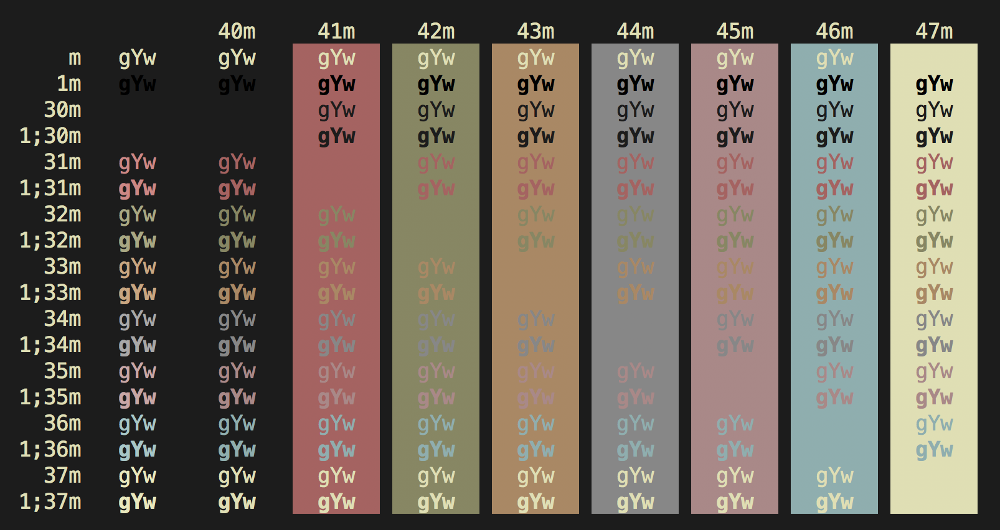
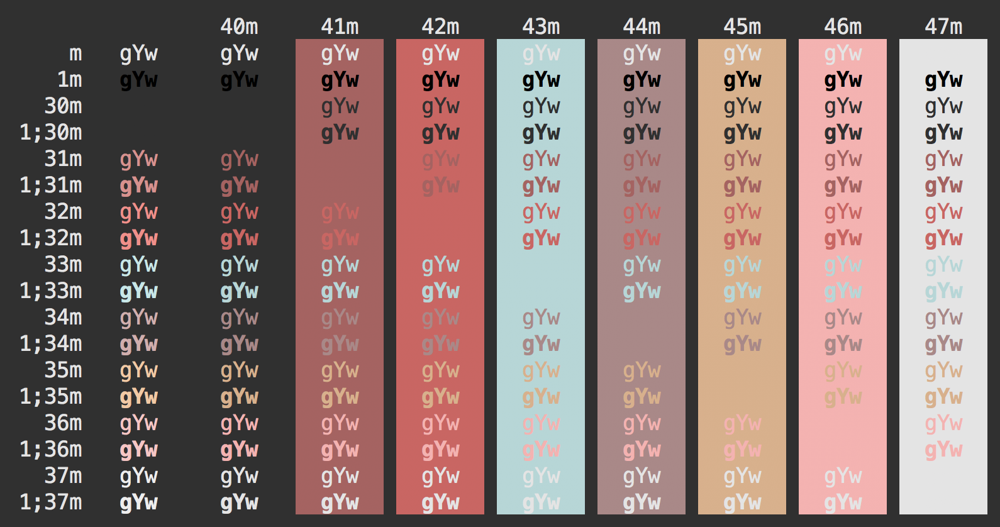
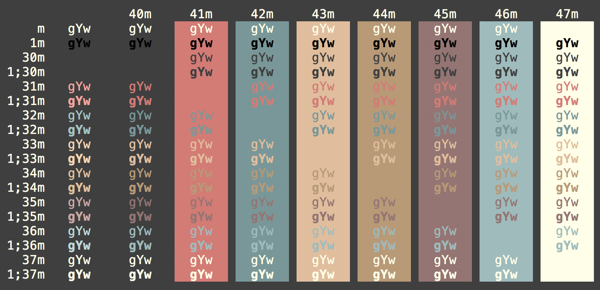
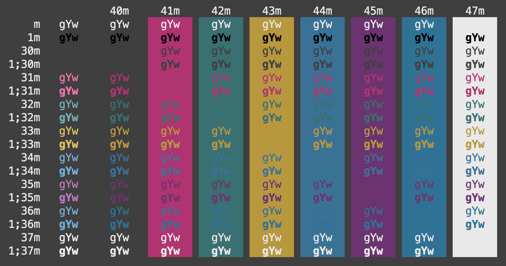

# terminal-themes

# Color schemes for various Mac OS X and Linux terminal emulators

This is a set of color schemes  (ported from [@AlessandroYorba][1]). 
Screenshots are below and in the `screenshots/` directory of this repo.

[1]: https://github.com/AlessandroYorba

## Installation Instructions

### Mac OS X

#### Terminal

- Clone or download this repo

- Go to `schemes/` folder

- Double click on selected `*.terminal` file. It will open a new Terminal window with that
  color scheme.

- Set the scheme as the default one with `Shell -> Use Settings as Default`

#### iTerm
- From the menu bar under iTerm > Preferences

- Once you’re in the preferences window, click on the profiles button.

- Then click on the colors tab.

- At the bottom there is a load presets button that will let you import the color themes that you cloned.

- In the little drop down window click import.

- Choose the theme that you would like to import.

### Linux (X-Client)

- Copy Xresources file into .Xresources

## Tools

### Convert iTerm 2 Color Scheme

This repo contains a tool to convert any iTerm 2 color scheme into Mac OS X
Terminal scheme. To run just execute script:

```
./tools/iterm2terminal.swift /path/to/my/awesome-scheme.itermcolors
```

### Generate Theme Preview

If you have an awesome schemes and going to publish them, please generate
preview image using the following steps.

1. Load the theme in a terminal.
2. Run
   ```
   bash tools/preview.sh
   ```
3. Set the font size to 14.
4. Take a screenshot and put it in the `screenshots/` folder.
5. Update the `README.md` to include your new screenshot.


## Screenshots

### Alduin 



### Sierra



### Despacio



### Arcadia


